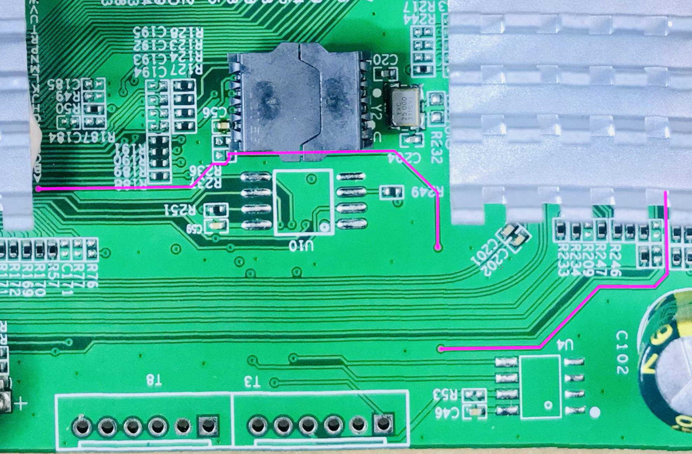
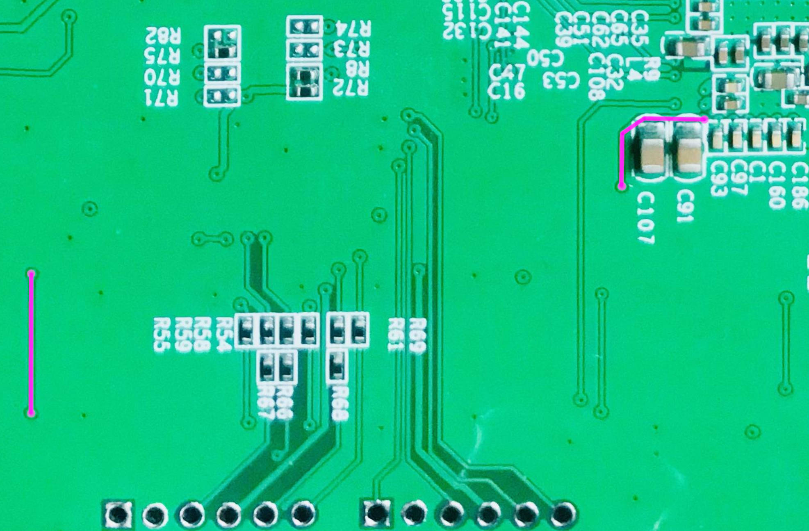

SWTG118AS Hacking
===

The repository for keeping my work data

To modify an unmanaged switch to have L2 management features.

First, I want to thank [libc0607](https://github.com/libc0607), [up-n-atom](https://github.com/up-n-atom), [FanFansfan](https://github.com/FanFansfan), and others for their contributions. Their research on Realtek RTL8372 firmware and hardware made the possibility of easy upgrades feasible.

The repository merely collects their contributions and adapts them to suit my usage environment.

### Only tested/verified on Fudan FM25Q16A

1. Extract [HRRF_V1.9.1_ZX-SWTGW218AS_0425.bin.zip](./firmwares/HRRF_V1.9.1_ZX-SWTGW218AS_0425.bin.zip) and write it into the flash

2. Read the UID of the flash first, then modify the parameters of `get_uid()` in [enc.py](./enc.py) and execute the script. You will get an **otp.bin** file for updating the OTP zone of the flash.

3. If you need to update the MAC or another default configuration, run [calcsum.py](./calcsum.py) to update the firmware and re-flash.

### Reset Button issues

Need to pull high a line on the PCB

**Top of PCB**

**Bottom of PCB**

### References

* [Some detail of RTL8372 firmware & Any progress on reverse engineering the UID algorithm?](https://github.com/up-n-atom/SWTG118AS/issues/4)

